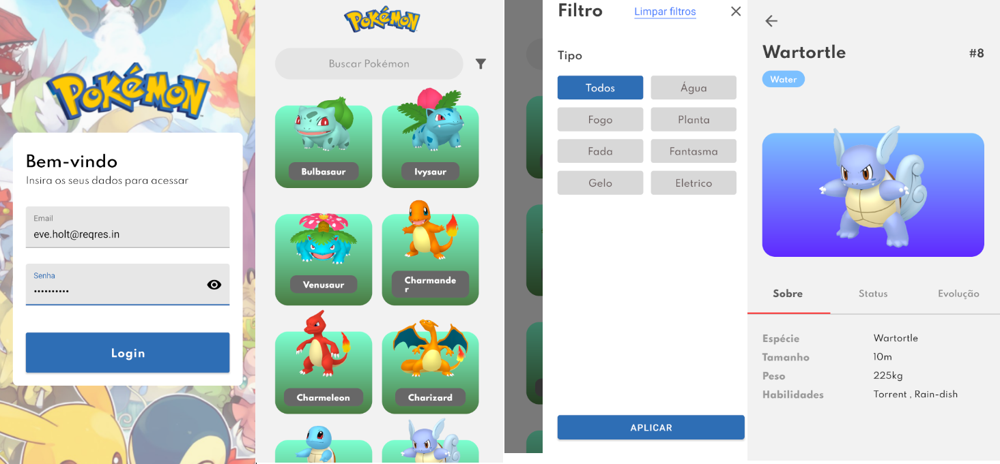

#  Developer Jobs

## Desafio da Mobix - Lógica

### Codigo dividido em quatro funções funções principais
  1. tokenize(expression: string) -> Array<string> : Função que recebe uma expressão qualquer
      Exemplo :   Input: "(3+2)" -> Output:["(", "3", "+","2",")"] 
  2. postfix(tokens: Array<string>) -> Array<string> : Função que recebe uma expressão tokenizada e retorna sua forma Postfix
      Exemplo : Input: ["(", "3", "+","2",")"] -> Output: ["3","2","+"] 
  3. calcPostfix(expression: string) -> Number : Função que recebe uma expressão postfix e realiza o calculo através de uma pilha
      Exemplo : Input: ["3","2","+"]  -> Output: 5
  4. calc(expression) -> Number : Função que chama as anteriores em sequência, faz o tratamento de exceção e realiza o cálculo
      Input: "(3+2)" -> Output: 5

## Desafio Front End Mobile

O desafio tem como objetivo avaliar a pessoa candidata nas experiências: 
* Criação de layouts
* Padrões no uso do React Native
* Boas práticas de programação e organização de projeto

### Aplicativo Criado

* A API a ser utilizada se encontra neste link: https://pokeapi.co/docs/v2#pokemon-section
* Link para o Figma https://www.figma.com/file/943D2Dx1H3uEVBMast3hzt/Teste-Pokemon?node-id=0%3A1
* NÃO será permitido o uso de Expo ou relacionados.
* Realizar login, validando email e senha com algum back end (use o back end que você achar conveniente).
* Manter o usuário logado no app após o login.
* Scroll Infinito.
* Armazene os dados que você achar mais importante para execução do app.

## Requisitos

### Obrigatório
- Uso de framework de components: Ant Design ou Bootstrap ou React Native Paper ou UIKitten ✅
- Styled-components ou Stylesheet ✅
- Redux, Redux Saga ou React Query ❌ - Usei no lugar: AsyncStorage ✅
- Redux-toolkit ❌
- TypeScript ✅
- Utilizar react navigation ✅
